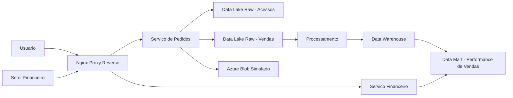

# Relatorio Tecnico - Projeto Final Scale-to-Insight

## 1. Escopo do Projeto

Infraestrutura emulada via Docker para atender o desafio técnico, com foco em camada de servicos, camada de dados e automacao CI/CD.

## 2. Atendimento dos Requisitos

### 2.1 Camada de Servicos

- Substituicao do monolito por dois servicos conteinerizados.
- Proxy reverso Nginx como porta de entrada do sistema.
- Simulacao de ambiente cloud com produtos Azure.

### 2.2 Camada de Dados

- Fluxo implementado: Origem (App) -> Processamento -> Destino.
- Data Lake camada Raw para:
    - logs de acesso
    - eventos de venda
- Data Warehouse com Data Mart de Performance de Vendas.

### 2.3 Automacao

- Pipeline CI/CD em GitHub Actions para:
    - validacao e build das imagens Docker
    - deploy simulado do ambiente

## 3. Diagrama de Atores e Componentes

## 4. Evidencias dos Entregaveis

- Ambiente local via Docker Compose.
- Documentacao de arquitetura no README.
- Pipeline CI/CD no GitHub Actions.
- Relatorio tecnico com diagrama de atores e componentes.
