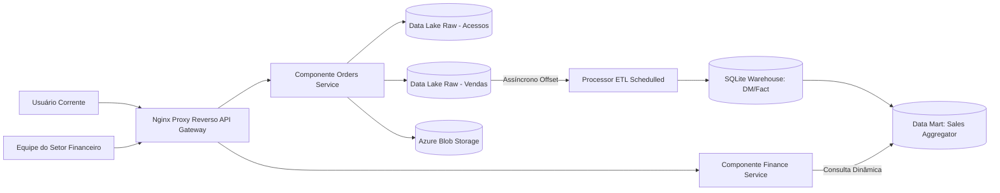

# Relatório Técnico - Scale-to-Insight

Este relatório técnico apresenta o projeto Scale-to-Insight, concebido para apoiar a transição de uma startup de e-commerce de uma arquitetura monolítica para um ecossistema de dados moderno, distribuído e orientado a eventos. Diante de picos de tráfego cada vez mais frequentes e da necessidade de decisões financeiras rápidas e embasadas, a solução proposta separa responsabilidades entre ingestão operacional, processamento analítico e exposição de indicadores. O resultado é uma base arquitetural capaz de sustentar crescimento, melhorar a resiliência operacional e entregar inteligência de negócio em tempo quase real para o setor financeiro.

## 1. Objetivo Técnico e Escopo

O principal objetivo tecnológico deste projeto é implementar uma arquitetura moderna para a ingestão e análise de dados de vendas. Para atingir essa meta, a solução foi desenhada priorizando a escalabilidade modular dos serviços envolvidos, garantindo que o pipeline de dados seja auditável em todas as suas etapas. Além disso, a arquitetura garante a exposição eficiente de indicadores financeiros e mantém uma operação e orquestração simples em um ambiente local, visando viabilizar provas de conceito e manutenções descomplicadas.

## 2. Requisitos Funcionais Cobertos

A implementação entregue cumpre e detalha os seguintes requisitos estabelecidos para a transformação arquitetural:
1. Fragmentação do monolito em dois (ou mais) serviços de aplicação conteinerizados independentes.
2. Utilização de um Gateway de entrada (Nginx) para gerenciar e rotear o tráfego externo.
3. Simulação de um ambiente de nuvem Azure (Cloud) via Azurite.
4. Concepção de um fluxo completo guiado a eventos: Origem (App) -> Processamento -> Destino.
5. Implantação de um Data Lake (camada Raw) voltado para a persistência bruta de acessos e vendas.
6. Modelagem dimensional de um Data Warehouse, culminando na criação de um Data Mart focado em performance de vendas.
7. Orquestração e automação de testes com um pipeline de CI/CD via GitHub Actions.

## 3. Decisões Arquiteturais e Justificativas Técnicas

### 3.1 Segmentação de Serviços Baseada em Responsabilidades
O ecossistema foi fracionado em três unidades fundamentais: o **Orders Service** (responsável pela ingestão de pedidos e escrita dos eventos operacionais transacionais), o **Finance Service** (focado na leitura analítica e exposição de KPIs de negócio) e o **Processor** (motor responsável pela transformação e consolidação dos dados). 

Essa divisão arquitetural foi motivada pela necessidade de reduzir criticamente o acoplamento entre fluxos de escrita de latência transacional e fluxos pesados de leitura analítica. Com essa abordagem, ganhamos a habilidade de escalar e evoluir cada componente do sistema independentemente, remetendo aos padrões de Command Query Responsibility Segregation (CQRS).

### 3.2 Utilização do Nginx como API Gateway
Para garantir isolamento e segurança da camada de aplicação perante a rede externa, o Nginx foi posicionado como o ponto único de entrada da arquitetura. 

A principal justificativa para essa escolha repousa na centralização do roteamento, o que simplifica drasticamente a complexidade do contrato externo voltado aos clientes da API. Ademais, essa blindagem de borda permite que a infraestrutura sofra escalonamento elástico e manutenções internas de roteamento sem que o cliente consiga perceber a fragmentação dos serviços operantes.

### 3.3 Construção de Data Lake Raw Otimizado e Emulação Cloud
A estratégia de engenharia de dados adotou a persistência de logs no formato JSONL (JSON Lines) localmente em conjunto com uma escrita simultânea de blobs hospedados em simulação Azure através do componente Azurite.

A preferência pelo formato JSONL deriva da simplicidade e extrema rapidez em operações de "append-only", propícias para grandes volumes de dados em fluxo, além de possuir fácil interpretação estrutural para fins de auditoria e reprocessamento (*replay* local). Paralelamente, a emulação da infraestrutura via Azurite nos permitiu validar, de forma acadêmica (sem custos impeditivos em nuvem), toda a integração estrita dos kits de desenvolvimento de software (SDKs) da nuvem Azure, simulando com alta fidedignidade o cenário corporativo que a Startup irá enfrentar.

### 3.4 Processamento e Persistência em Data Warehouse
Foi adotado o banco de dados relacional SQLite como o motor fundamental a abrigar as estruturas orientadas à dimensão do Data Warehouse (DW) e do Data Mart (DM).

A decisão pelo SQLite balizou-se numa abordagem pragmática focada em execução e portabilidade locais de âmbito acadêmico. A ferramenta nos serve de base para operar comandos e tipagens SQL nativas, sendo poderosa o suficiente para suportar operações de consolidação, elaborados relacionamentos em blocos (JOINs) baseados no modelo Snow-flake (Fatos e Dimensões), e cálculos dinâmicos de agregação para o Data Mart. Reconhece-se, como trade-off projetual, que este artefato de armazenamento transacional simples não subsistiria numa infraestrutura de elevada concorrência concorrente e de escalabilidade global (onde motores massivamente paralelos e específicos seriam primordiais).

### 3.5 Evolução do Controle Baseada em Schedulers
A governança sobre a rotina de Extração, Transformação e Carga (ETL) no processador abandonou as amarras rudimentares de loopings estáticos na thread primária, dando espaço vitalício à orquestração via *ScheduledExecutorService*.

Esta evolução madura curou antigos problemas de bloqueio de fluxos principais (esmagamento da main thread) e alocação inconsequente de processamento gerados por travas como `Thread.sleep`. O uso desse agendador capacitou o software a efetuar a liberação limpa de recursos alocados (*Graceful Shutdown*). Como resultado, obtém-se o perdão da integridade do banco de dados na eventual interrupção de contêineres e um término seguro dos arquivos Raw abertos em meio às extrações.

## 4. Modelagem de Dados e Taxonomia Analítica

### 4.1 Camada Raw (Data Lake)
Estabelecida em arquitetura de diretórios para garantir a imutabilidade bruta:
- `data/raw/access/events.jsonl` (Auditoria e tráfego orgânico)
- `data/raw/sales/events.jsonl` (Métricas de eventos transacionais inalterados)

### 4.2 Camada de Consolidação (Data Warehouse)
Tabelas orientadas metodologicamente sob um design transacional-dimensional:
- `dim_date` (Unificadora base de dimensões temporais cruzadas pelo calendário)
- `fact_sales` (Repositório de eventos de interações associadas às suas chaves dimensionais)

### 4.3 Camada de Exposição (Data Mart)
Foco exclusivo na apuração de indicadores e consumo leve de rotinas de negócios voltada ao Setor Financeiro:
- `dm_sales_performance` (Métricas corporativas resumidas, como `total_sales`, `total_orders`, e `avg_ticket`).

## 5. Fluxograma Operacional Operante

O raciocínio sistêmico adotado para as simulações compreende a seguinte coreografia de fluxos de eventos:
1. Uma requisição orgânica tangibiliza tráfego no host Docker entrando pelo gateway **Nginx**.
2. Pedidos mercadológicos efetuados pelos clientes finais são interceptados via **Orders Service**.
3. Mantendo um padrão guiado a assincronismo, este microsserviço escreve o rastro audivel de venda no log JSONL do **Data Lake Raw** do volume local e dispara um carregamento simultâneo final para o **Blob no Azurite**.
4. Rodando nos bastidores de forma alheia, a casca primária de ETL, o **Processor**, desperta de acordo com seu cronograma predefinido na máquina virtual (Timer Trigger de 5s).
5. Este agente rastreia e consome com *offsets* seguros as injeções nos logs passados pelas vendas para povoar a Tabela Fato relacionando-as contra o modelo temporal de Dimensões.
6. Imediatamente após carregar os registros na nuvem Data Warehouse, seu bloco recalculador subscreve dados agregados formando materializações analíticas enxutas no data mart primário.
7. Diante de requisições analíticas da alta diretoria no dashboard corporativo, ocorre novo roteamento Nginx consumindo de maneira irrisória o banco atrelado ao **Finance Service**, o qual disponibiliza apenas indicadores calculados outrora no Data Mart.

## 6. Qualidade, Testabilidade e Integração (CI/CD)

A garantia de qualidade reflete um fluxo contínuo implementado transparentemente na infraestrutura repositória através do fluxo estritamente delineado em `.github/workflows/ci-cd.yml`:

- **Checkout**: Garantido alinhamento ao estado mestre dos códigos transacionados;
- **Validação Sintática**: Aprovação das configurações de orquestração sob o framework Compose antes de compilação morosa (Fail Fast);
- **Construção Segregada**: Execução multiestágio que abstrai a instalação manual e burocracia das compilações Java host, injetando *Jars* robustos e blindados sem poluir os sistemas operacionais host.
- **Micro Deploy Contínuo Simulado**: Inserção imperativa e efêmera de subida de todo container simulando a esteira num processo de homologação cega instanciando os clusters;
- **Smoke Tests Assertivos**: Simula um trafego de cliente através de requisições POST segredadas por Wait-Tempos que medem interativamente a tolerância do ecosistema validando na linha de chegada (Finance Service) o impacto direto provindos das transformações do Processor no tráfego Nginx.
- **Teardown Cauteloso**: Desprovisiona resíduos com a devida remoção das *Dangling Layers* efêmeras do cluster CI em conformidade as melhores práticas.

## 7. Apontamentos sobre Limitações e Gerenciamento de Riscos

Ao assumir o pragmatismo, ponderou-se contra certas características complexas a serem avaliadas posteriormente:
1. Abstração na segurança criptográfica ou *Single-Sign On* e gestão avançada do escrutínio nas chamadas (Oauth / Token Identity).
2. Ausência da maturidade em barramento corporativo *Messaging Queue (e.g. Apache Kafka, RabbitMQ)* o qual se tornaria mandatário em *Scale-Up's* previnindo uma potencial quebra generalizada se o Orders service sobrecarregasse.
3. Tratativa Full-Refresh adotada localmente do DM perante *Incremental Materializations*.

## 8. Diagrama de Rede, Atores e Componentes Lógicos

